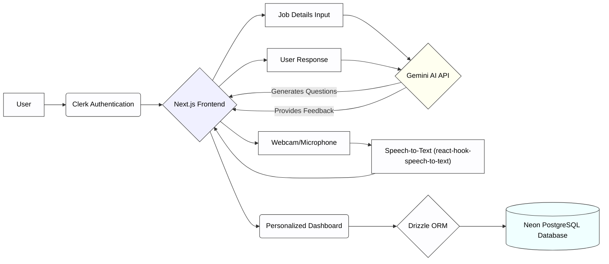

# 🎙️ AI Mock Interviewer - Level Up Your Interview Skills! 🚀

AI Mock Interviewer is a comprehensive full-stack web application designed to empower you with the confidence and skills to ace your next job interview. By harnessing the power of Google's Gemini AI, the application creates personalized interview simulations, provides real-time speech-to-text transcription, and offers instant, insightful feedback.

Click here to experience AI Mock Interviewer: [ai-mock-interviewer-six.vercel.app](https://ai-mock-interviewer-six.vercel.app/)

## ✨ Project Overview & Architecture

This project aims to provide a realistic and effective platform for interview preparation. Users can define their target job role and experience level, and the AI will generate relevant interview questions. The application records and transcribes their answers, providing immediate feedback on content, delivery, and overall performance.  It's designed for anyone looking to improve their interview skills, from recent graduates to seasoned professionals.

### 🏛️ Architecture Diagram



**Key Architectural Decisions:**

*   **Next.js App Router:**  Utilizing the latest Next.js App Router for improved routing and server-side rendering capabilities.
*   **Gemini AI for Question Generation and Feedback:**  Leveraging the power of Gemini AI to provide relevant questions and insightful feedback.
*   **Neon PostgreSQL Database:** Choosing a serverless Postgres database for scalability and ease of management.
*   **Clerk for Authentication:** Implementing Clerk for secure and seamless user authentication and management.

### 🌟 Key Features

*   🤖 **AI-Powered Question Generation:** Creates tailored interview questions based on your target role and experience.
*   🗣️ **Interactive Mock Interviews:** Simulates a real interview experience with webcam support and voice recording.
*   🎙️ **Real-time Speech-to-Text:** Transcribes your spoken answers automatically using `react-hook-speech-to-text`.
*   📈 **Instant AI Feedback:** Provides a rating and detailed feedback on your performance after each answer.
*   📊 **Personalized Dashboard:** Tracks your interview history and feedback for continuous improvement.
*   🔐 **Secure Authentication:** Uses Clerk for secure user sign-up and sign-in.

### 🛠️ Technology Stack

*   **Framework**: Next.js 14 (App Router)
*   **AI**: Google Gemini API (`@google/generative-ai` version 0.14.0)
*   **Database**: Neon (PostgreSQL)
*   **ORM**: Drizzle ORM (version 0.31.2)
*   **Authentication**: Clerk (version 5.1.6)
*   **UI**: Tailwind CSS, shadcn/ui, Framer Motion (version 11.2.12)
*   **Speech-to-Text**: `react-hook-speech-to-text` (version 0.8.0)
*   **Deployment**: Vercel

## 🚀 Getting Started

Follow these steps to set up and run the project locally.

### ✅ Prerequisites

*   Node.js (version 18 or later)
*   npm, yarn, or pnpm package manager
*   A Google Gemini API Key
*   A Clerk Account
*   A Neon Database

### ⚙️ Installation

1.  **Clone the Repository:**

    ```bash
    git clone <repository_url>
    cd ai-mock-interviewer
    ```

2.  **Install Dependencies:**

    ```bash
    npm install  # or yarn install or pnpm install
    ```

3.  **Set up Environment Variables:**

    Create a `.env.local` file in the root directory and add the following environment variables:

    ```
    DATABASE_URL="<Your Neon Database URL>"
    NEXT_PUBLIC_CLERK_PUBLISHABLE_KEY="<Your Clerk Publishable Key>"
    CLERK_SECRET_KEY="<Your Clerk Secret Key>"
    GOOGLE_API_KEY="<Your Google Gemini API Key>"
    NEXT_PUBLIC_CLERK_SIGN_IN_URL="/sign-in"
    NEXT_PUBLIC_CLERK_SIGN_UP_URL="/sign-up"
    NEXT_PUBLIC_CLERK_AFTER_SIGN_IN_URL="/"
    NEXT_PUBLIC_CLERK_AFTER_SIGN_UP_URL="/"
    ```

    Replace the placeholders with your actual values.  Refer to the Neon, Clerk, and Google Gemini documentation for instructions on obtaining these keys.

4.  **Database Migrations:**

    ```bash
    npm run db:push   # This will push the drizzle schema to your Neon database
    ```

### 🏃 Quick Start

1.  **Start the Development Server:**

    ```bash
    npm run dev
    ```

2.  **Open in Browser:**

    Open your web browser and navigate to `http://localhost:3000`.

### 💡 Usage Examples

*   **Creating a New Interview:**

    After signing in, navigate to the "Create Interview" page.  Enter the job title, job description, and your years of experience.  The AI will generate a set of relevant interview questions.

*   **Answering Questions:**

    When prompted, allow the application access to your webcam and microphone. Speak clearly and naturally. Your answers will be transcribed in real-time.

*   **Receiving Feedback:**

    After providing your answer, the AI will provide a rating and detailed feedback. Review the feedback carefully to identify areas for improvement.

*   **Viewing Interview History:**

    Access your personalized dashboard to review your completed interviews and feedback.

## 📚 Detailed Usage Guide

### 🧩 Core Functionality

The core functionality revolves around simulating a realistic interview experience.  The AI generates questions tailored to the user's specified role and experience, allowing users to practice their responses.  The speech-to-text transcription and AI-powered feedback loop provide valuable insights for improvement.

```javascript
// Example: Fetching AI-generated questions

import { generateInterviewQuestions } from './lib/ai';

async function createInterview(jobTitle, jobDescription, yearsOfExperience) {
  const questions = await generateInterviewQuestions(jobTitle, jobDescription, yearsOfExperience);
  return questions;
}

// Example usage
createInterview("Software Engineer", "Develop and maintain web applications", 3)
  .then(questions => console.log(questions))
  .catch(error => console.error(error));
```

### ⚙️ Configuration Options

The primary configuration options are managed through environment variables in the `.env.local` file. These options control database connections, API keys, and authentication settings. Ensure that these variables are set correctly for the application to function properly.

### ⚠️ Troubleshooting

*   **Database Connection Errors:** Verify that the `DATABASE_URL` environment variable is correctly set and that your Neon database is running.
*   **API Key Errors:**  Double-check that your Google Gemini API Key and Clerk API keys are valid and have the necessary permissions.
*   **Webcam/Microphone Issues:**  Ensure that your webcam and microphone are properly connected and that the application has permission to access them.  Check your browser's privacy settings.
*   **Speech-to-Text Errors:** Ensure you are speaking clearly and that your microphone is functioning correctly. Try refreshing the page.

## 🧑‍💻 Development & Contribution

We welcome contributions to the AI Mock Interviewer project!  Please follow these guidelines when developing and contributing.

### 🛠️ Development Setup

1.  **Clone the Repository:**

    ```bash
    git clone <repository_url>
    cd ai-mock-interviewer
    ```

2.  **Install Dependencies:**

    ```bash
    npm install  # or yarn install or pnpm install
    ```

3.  **Set up Environment Variables:**

    Create a `.env.local` file (as described in the Installation section) and configure your environment variables.

4.  **Start the Development Server:**

    ```bash
    npm run dev
    ```

### ✅ Testing

The project includes unit tests and integration tests. To run the tests:

```bash
# Currently no specific testing framework is configured
# Implement a testing framework like Jest and add test scripts in package.json.
# Example: npm test
# For now, manual testing is recommended.
```

### 🎨 Code Style

Follow the existing code style conventions. We recommend using an editor with ESLint and Prettier configured to automatically format your code.

### 🌿 Git Workflow

1.  **Create a Branch:**

    Create a new branch for your feature or bug fix.

    ```bash
    git checkout -b feature/my-new-feature
    ```

2.  **Commit Changes:**

    Commit your changes with clear and descriptive commit messages.

3.  **Push to Remote:**

    Push your branch to the remote repository.

    ```bash
    git push origin feature/my-new-feature
    ```

### 🤝 Pull Request Process

1.  **Submit a Pull Request:**

    Create a pull request from your branch to the `main` branch.

2.  **Code Review:**

    Your pull request will be reviewed by other contributors. Address any feedback and make necessary changes.

3.  **Merge:**

    Once your pull request has been approved, it will be merged into the `main` branch.

### 🐞 Issue Reporting

If you encounter any issues, please report them on the GitHub issue tracker. Provide a clear description of the issue, steps to reproduce it, and any relevant error messages.

### 📜 Code of Conduct

Please adhere to the project's code of conduct.  A standard code of conduct (e.g., Contributor Covenant) is implied, focusing on creating a welcoming and inclusive environment for all contributors.
